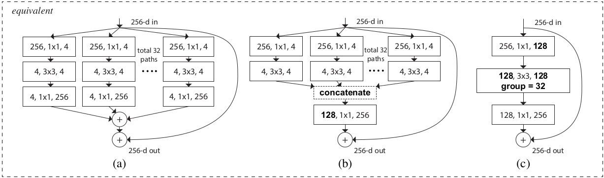
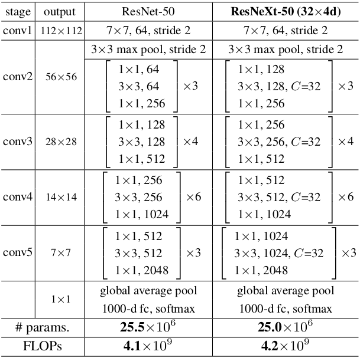

# Implement-ResNeXt-with-Keras

<a href="https://arxiv.org/pdf/1611.05431.pdf"> ResNeXt </a> is an important mileston in the growth of convolutional networks, especially for Residual Networks.

Here is a proposal to implement ReNeXt with Keras. Our implementation is inspired by <a href="https://github.com/taki0112/ResNeXt-Tensorflow">ResNeXt-Tensorflow</a>

## Requirements

<ul>
    <li> Python 3.x </li>
    <li> Tensorflow 1.x </li>
    <li> Keras 2.2.4 </li>
</ul>

## Architectures



<ol type="a">
    <li>The original building block of ResNeXt : Aggregated residual transformations</li>
    <li>First Reformulation, implemented as early concatenation</li>
    <li>Second Reformulation which includes grouped convolution</li>
</ol>

We implemented the first reformulation which consists of ***split***, ***transform+merge*** and ***transition*** operations.

## Principles

### Split

Split the input channels into groups. The total number of groups is equals to the cardinality which is c=4 in our case

```python
def split(inputs, inputs_channels, cardinality):
    group_size = inputs_channels / cardinality    
    groups = list()    
    for number in range(1, cardinality+1):
        begin = int((number-1)*group_size)
        end = int(number*group_size)
        block = Lambda(lambda x:x[:,:,:,begin:end])(inputs)
        groups.append(block)    
    return groups
```

### Transform + merge

Perform two consecutive convolution operations on each group: 1x1 and 3x3 (Transform) followed by concatenation (Merge)

```python
def transform(groups, filters, strides, stage, block):
    f1, f2 = filters    
    conv_name = "conv2d-{stage}{block}-branch".format(stage=str(stage), block=str(block))
    bn_name = "batchnorm-{stage}{block}-branch".format(stage=str(stage), block=str(block))
    
    transformed_tensor = list()
    i = 1
    
    for inputs in groups:
        # first conv of the transformation phase
        x = Conv2D(filters=f1, kernel_size=(1,1), strides=strides, padding="valid", 
                   name=conv_name+'1a_split'+str(i), kernel_initializer=glorot_uniform(seed=0))(inputs)
        x = BatchNormalization(axis=3, name=bn_name+'1a_split'+str(i))(x)
        x = Activation('relu')(x)

        # second conv of the transformation phase
        x = Conv2D(filters=f2, kernel_size=(3,3), strides=(1,1), padding="same", 
                   name=conv_name+'1b_split'+str(i), kernel_initializer=glorot_uniform(seed=0))(x)
        x = BatchNormalization(axis=3, name=bn_name+'1b_split'+str(i))(x)
        x = Activation('relu')(x)
        
        # Add x to transformed tensor list
        transformed_tensor.append(x)
        i+=1
        
    # Concatenate all tensor from each group
    x = Concatenate(name='concat'+str(stage)+''+block)(transformed_tensor)
    
    return x
```

### Transition

The last conv layer of the building block of (b)

```python
def transition(inputs, filters, stage, block):
    x = Conv2D(filters=filters, kernel_size=(1,1), strides=(1,1), padding="valid", 
                   name='conv2d-trans'+str(stage)+''+block, kernel_initializer=glorot_uniform(seed=0))(inputs)
    x = BatchNormalization(axis=3, name='batchnorm-trans'+str(stage)+''+block)(x)
    x = Activation('relu')(x)
    
    return x
```

## Building Blocks

The wall architecture is as follow



<ul>
    <li> Identity Block : Building blocks contained is the same stage. They have same input and output dimensions </li>
    <li> Downsampling Block : Transition between two building blocks whose the output dimension of the first block is different from that of the input of the other block.</li>
</ul>

## References

<ol>
    <li> <i>Xie et al. (2017)</i> <a href="https://arxiv.org/pdf/1611.05431.pdf">Aggregated Residual Transformations for Deep Neural Networks</a> </li>
    <li> <i>He et al. (2015)</i> <a href="https://www.cv-foundation.org/openaccess/content_cvpr_2016/papers/He_Deep_Residual_Learning_CVPR_2016_paper.pdf">Deep Residual Learning for Image Recognition</a> </li>
    <li> <i> Marco Peixeiro </i> GitHub repository : <a href="https://github.com/marcopeix/Deep_Learning_AI/blob/master/4.Convolutional%20Neural%20Networks/2.Deep%20Convolutional%20Models/Residual%20Networks.ipynb">Residual Networks</a></li>
    <li> GitHub Repository: <a href="https://github.com/taki0112/ResNeXt-Tensorflow#what-is-the-transition-">ResNeXt-Tensorflow</a></li>
</ol>

## Author

Carmel WENGA, Deep Learning Engineer - Nzhinusoft

### Visit our Market Place

[shoppinglist.cm](https://shoppinglist.cm "Your market place")

